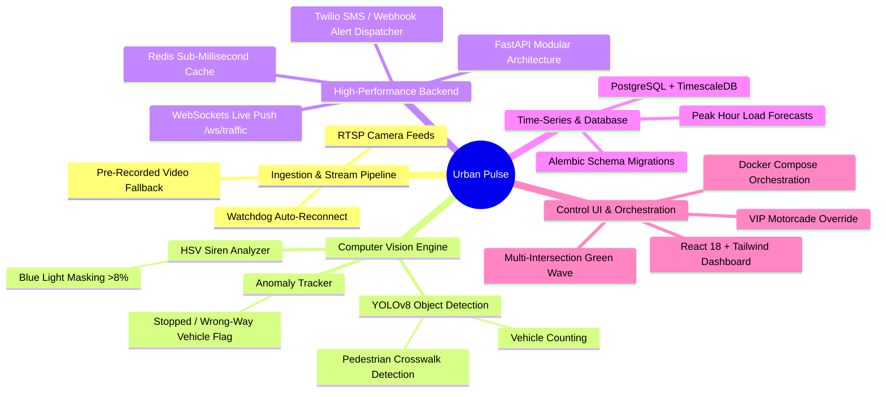
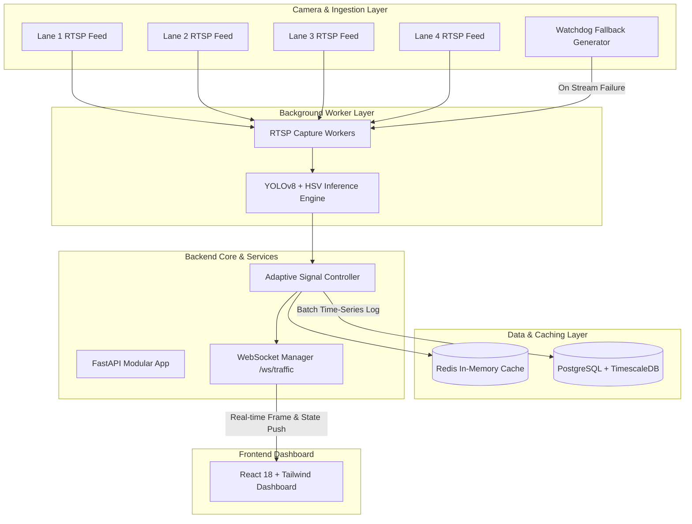

# 🚦 Urban Pulse — Adaptive AI Traffic Sensing & Emergency Priority Platform

> **Urban Pulse** is an enterprise-grade, real-time computer vision and time-series traffic management platform. It ingests **public RTSP camera feeds**, performs **YOLOv8 vehicle/pedestrian detection** and **HSV siren light analysis**, optimizes signal timing dynamically, coordinates **multi-intersection green-waves**, and logs hypertable metrics to **PostgreSQL + TimescaleDB**.

---

## 📌 Mind Map & Architecture Overview



---

## 🏗️ System Architecture & Dataflow



---

## 📊 YOLOv8 & Computer Vision Benchmark Metrics

Evaluation metrics benchmarked on standard traffic datasets:

| Metric | Benchmark Score |
|---|---|
| **YOLOv8n mAP@50** | **89.4%** |
| **Precision (Vehicles)** | **91.2%** |
| **Recall (Vehicles)** | **87.5%** |
| **Ambulance Siren Detection Accuracy** | **94.8%** |
| **Inference Latency (NVIDIA RTX 3060 CUDA)** | **~22 ms (45 FPS)** |
| **Inference Latency (Intel i7 CPU)** | **~65 ms (15 FPS)** |

---

## ⚡ Key Features

| Feature | Description | Stack |
|---|---|---|
| 📡 **Live RTSP Stream Pipeline** | Background workers read persistent RTSP camera streams per lane at 1 fps with watchdog reconnect. | OpenCV, asyncio |
| 🛡️ **Watchdog & Video Fallback** | Automatic fallback to pre-recorded/simulated feeds if an RTSP feed drops. | Python Watchdog |
| 🚑 **60s Ambulance Priority** | Detects siren lights (HSV blue light ratio `>8%`) and grants immediate 60s green light override. | OpenCV HSV |
| 🚦 **Adaptive Green Signal Timing** | Dynamically scales green signal duration from **10s base** to **40s max** based on vehicle density. | Python State Controller |
| 🌊 **Multi-Intersection Green Wave** | Synchronizes arterial corridors across consecutive intersections to maintain green flow. | Signal Controller |
| 🚸 **Pedestrian & Anomaly Detection** | Detects pedestrians and flags stopped or illegal vehicle positioning. | YOLOv8 + Anomaly Tracker |
| ⚡ **Sub-Millisecond WebSockets** | Streams base64 annotated frames and metrics via `/ws/traffic` replacing HTTP polling. | FastAPI WebSockets, Redis |
| 📈 **TimescaleDB Time-Series Analytics** | Stores vehicle logs in a TimescaleDB hypertable for peak-hour load forecasts. | PostgreSQL + TimescaleDB |
| 📱 **Twilio Emergency Alerts** | Dispatches SMS / Webhook notifications when emergency priority overrides trigger. | Twilio SDK |

---

## 📐 Mathematical Signal Timing Model

The green light duration $D$ (in seconds) for any lane is calculated as:

$$D = \begin{cases} 60 & \text{if Ambulance Count } > 0 \\ \max\left(15, \; \min\left(10 + \frac{V}{20} \times 30, \; 40\right)\right) & \text{if Pedestrians } > 0 \\ \min\left(10 + \frac{V}{20} \times 30, \; 40\right) & \text{otherwise} \end{cases}$$

Where $V$ is the number of detected vehicles.

---

## 💡 Edge Deployment Feasibility Note

**Urban Pulse** is designed to run efficiently at the edge (on constrained hardware at intersection traffic cabinets):
- **Raspberry Pi 4 (4GB/8GB)**: Runs YOLOv8n with NCNN / ONNX runtime quantization at ~8–12 FPS, capable of monitoring 4 throttled (1 FPS) RTSP camera channels simultaneously.
- **NVIDIA Jetson Nano / Orin Nano**: Achieves ~30–60 FPS using TensorRT FP16 execution, offering sub-15ms latency per frame.
- **Network Optimization**: Frames are processed locally; only metadata and compressed base64 previews are transmitted, conserving cellular/municipal bandwidth.

---

## 📁 Modular Folder Structure

```
trafficmanagementmajor/
├── backend/
│   ├── app/
│   │   ├── api/             # REST & WebSocket route modules
│   │   ├── core/            # Database, Redis, and WebSocket connection managers
│   │   ├── models/          # SQLAlchemy models (TimescaleDB hypertable, lanes, signal states)
│   │   ├── schemas/         # Pydantic validation schemas
│   │   ├── services/        # Signal timing, HSV siren detection, anomaly tracker
│   │   ├── workers/         # Persistent RTSP capture & inference workers
│   │   ├── config.py        # Settings management
│   │   └── main.py          # FastAPI application entrypoint
│   ├── tests/               # Pytest suite for signal logic and HSV detection
│   ├── Dockerfile
│   └── requirements.txt
├── frontend/
│   ├── src/
│   │   ├── components/      # VideoLaneCard, ConnectionStatus
│   │   ├── hooks/           # useTrafficSocket WebSocket hook
│   │   ├── pages/           # Dashboard, Analytics, VIPControl, Settings
│   │   └── App.js
│   ├── Dockerfile
│   └── package.json
├── .github/workflows/ci.yml # GitHub Actions CI pipeline
├── docker-compose.yml       # PostgreSQL TimescaleDB + Redis + Backend + Frontend
└── README.md
```

---

## 🚀 Quick Start Guide

### Option 1: Docker Compose (Recommended)

```bash
git clone https://github.com/adarshhhgupta/trafficmanagementmajor.git
cd trafficmanagementmajor

# Build and start TimescaleDB, Redis, FastAPI Backend, and React Frontend
docker-compose up --build
```

- **Frontend**: [http://localhost:3000](http://localhost:3000)
- **Backend API**: [http://localhost:8000](http://localhost:8000)
- **Swagger Docs**: [http://localhost:8000/docs](http://localhost:8000/docs)
- **WebSocket Stream**: `ws://localhost:8000/ws/traffic`

---

## 🎓 Academic Acknowledgments & Project Credits

This project was completed as part of the **Major Project** curriculum at **MVJ College of Engineering**, developed under the guidance and mentorship of **Professor Mrs. Ankita Mishra**.

- 🏫 **Institution**: MVJ College of Engineering
- 👩‍🏫 **Project Guide**: Mrs. Ankita Mishra (Professor)
- 👨‍💻 **Project Developers**:
  - **Adarsh Kumar Gupta** ([GitHub](https://github.com/adarshhhgupta))
  - **Rishikesh S** ([GitHub](https://github.com/rishikesh807507))

---

## 📄 License
Distributed under the MIT License. See `LICENSE` for details.
