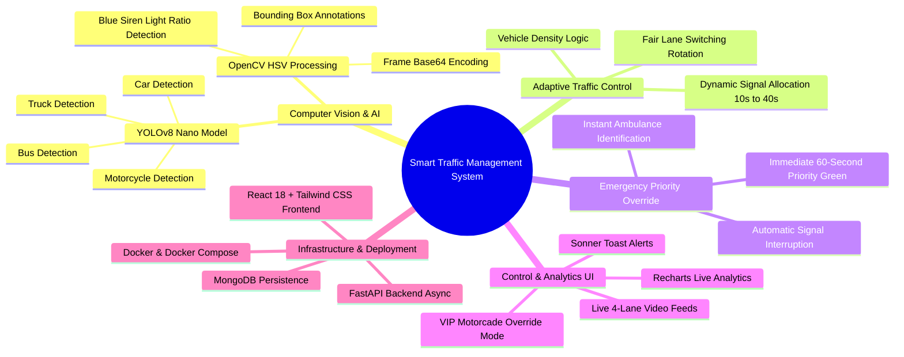
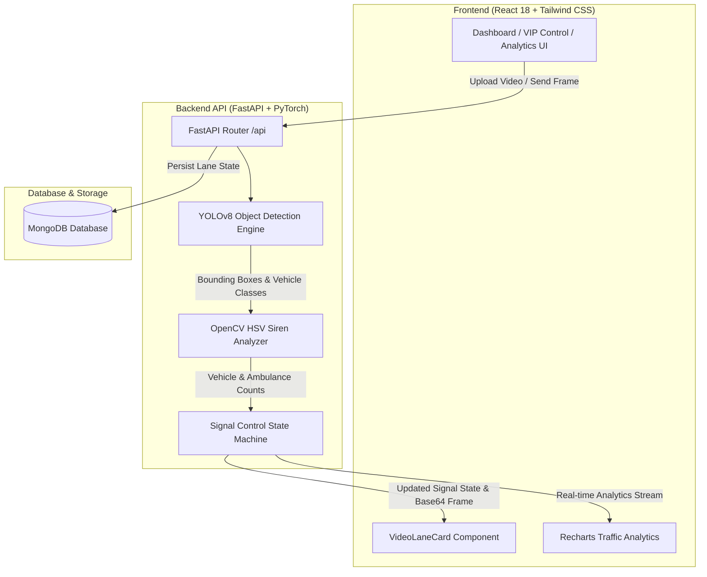
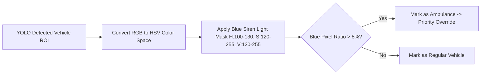

# 🚦 Smart AI Traffic Management & Emergency Vehicle Priority System

> An intelligent, real-time computer vision and machine learning platform for 4-lane intersection traffic control, automatic vehicle density evaluation, emergency ambulance priority overriding, and VIP motorcade signal routing.

---

## 📌 Executive Summary & Mind Map



---

## 🏗️ System Architecture & Workflow



---

## 🌟 Key Features

| Feature | Description | Tech Stack |
|---|---|---|
| 🎥 **4-Lane Live Video Feed** | Simultaneous processing and frame-by-frame analysis for 4 intersection lanes. | React, OpenCV, HTML5 Video |
| 🚗 **YOLOv8 Vehicle Detection** | Real-time counting and object classification for Cars, Motorcycles, Buses, and Trucks. | YOLOv8n, PyTorch, OpenCV |
| 🚑 **HSV Ambulance Siren Detection** | Specialized computer vision algorithm identifying emergency vehicle siren blue light ratios (`>8%` threshold within ROI). | OpenCV HSV Masking |
| 🚦 **Adaptive Green Signal Timing** | Dynamically scales green signal duration from **10s base** to **40s max** proportional to vehicle density. | Python State Machine |
| ⚡ **Emergency Priority Override** | Grants immediate **60-second priority green light** to lanes with detected ambulances, overriding normal cycles. | Async State Controller |
| 👑 **VIP Convoy Override** | Manual admin control interface to force specific lanes green for official motorcades (up to 5 mins). | FastAPI + React State |
| 📊 **Real-Time Analytics & Dashboard** | Live density graphs, active signal status indicators, and total intersection volume tracking. | Recharts, Lucide Icons |

---

## 🧠 Core Algorithm Logic

### 1. Ambulance Siren Light Detection


### 2. Signal Timing Formula
The green signal duration $D$ (in seconds) for a given lane is computed as:

$$D = \begin{cases} 60 & \text{if Ambulance Count } > 0 \\ \min\left(10 + \frac{V}{20} \times 30, \; 40\right) & \text{otherwise} \end{cases}$$

Where $V$ is the number of vehicles detected in the target lane.

---

## 📁 Repository Structure

```
trafficmanagementmajor/
├── backend/
│   ├── server.py              # FastAPI application server, YOLO processing, API routes
│   ├── requirements.txt       # Python dependencies (FastAPI, YOLOv8, PyTorch, OpenCV, Motor)
│   ├── Dockerfile             # Container definition for backend service
│   └── .env                   # Environment variables configuration
├── frontend/
│   ├── src/
│   │   ├── App.js             # Navigation layout and client routing
│   │   ├── index.js           # React entrypoint
│   │   ├── components/
│   │   │   ├── VideoLaneCard.js      # Individual lane feed card component
│   │   │   └── TrafficAnalytics.js   # Analytics chart component
│   │   └── pages/
│   │       ├── Dashboard.js   # Main 4-lane control dashboard
│   │       ├── Analytics.js   # Detailed analytics and charts page
│   │       ├── VIPControl.js  # Manual VIP motorcade override panel
│   │       └── Settings.js   # System parameters and reset controls
│   ├── package.json           # Frontend dependencies (React, Lucide, Recharts, Tailwind)
│   ├── Dockerfile             # Container definition for frontend service
│   └── .env                   # Frontend backend URL setting
├── docker-compose.yml         # Unified Docker orchestration (MongoDB + Backend + Frontend)
└── README.md                  # Project documentation & reference
```

---

## ⚙️ Environment Variables

### Backend (`backend/.env`)
```env
MONGO_URL=mongodb://localhost:27017
DB_NAME=traffic_management
CORS_ORIGINS=http://localhost:3000
```

### Frontend (`frontend/.env`)
```env
REACT_APP_BACKEND_URL=http://localhost:8000
```

---

## 🚀 Quick Start Guide

### Option 1: Docker Compose (Recommended)

Run all 3 services (MongoDB, FastAPI Backend, React Frontend) in isolated containers:

```bash
# 1. Clone repository
git clone https://github.com/adarshhhgupta/trafficmanagementmajor.git
cd trafficmanagementmajor

# 2. Launch using Docker Compose
docker-compose up --build
```

- **Frontend Application**: [http://localhost:3000](http://localhost:3000)
- **Backend API Server**: [http://localhost:8000](http://localhost:8000)
- **Interactive API Documentation (Swagger)**: [http://localhost:8000/docs](http://localhost:8000/docs)

---

### Option 2: Local Manual Setup

#### 1. Backend Setup (FastAPI + YOLO)
```bash
cd backend

# Create & activate Python virtual environment
python -m venv venv
# On Windows:
.\venv\Scripts\activate
# On Linux/macOS:
source venv/bin/activate

# Install dependencies
pip install -r requirements.txt

# Start backend server
python server.py
```

#### 2. Frontend Setup (React App)
```bash
cd frontend

# Install npm dependencies
npm install

# Start React development server
npm start
```

---

## 🌐 API Endpoint Reference

| HTTP Method | Route | Description |
|---|---|---|
| `GET` | `/api/` | Server health check endpoint |
| `POST` | `/api/upload-video/{lane_id}` | Upload video file for a specific lane |
| `POST` | `/api/process-frame/{lane_id}` | Analyze frame with YOLOv8 & HSV, return bounding boxes & metrics |
| `GET` | `/api/traffic-state` | Fetch current signal statuses and density metrics for all 4 lanes |
| `GET` | `/api/lane-status/{lane_id}` | Retrieve real-time state for a single lane |
| `POST` | `/api/vip-mode` | Activate manual VIP override for a specified lane |
| `POST` | `/api/vip-mode/disable` | Disable VIP override and resume automatic AI signal rotation |
| `GET` | `/api/vip-status` | Get active VIP override status and remaining countdown |
| `GET` | `/api/analytics` | Summary vehicle totals, average density, and historical data for charts |
| `POST` | `/api/reset` | Reset entire system state and clear active processing |

---

## 🛠️ GitHub Repository & Sync Workflow

This project is configured with dual Git remotes for streamlined collaboration:

```bash
# Push your changes to your fork:
git add .
git commit -m "Your feature description"
git push origin main

# Sync latest changes from upstream:
git pull upstream main
git push origin main
```

---

## 📄 License
Distributed under the MIT License. See `LICENSE` for details.
